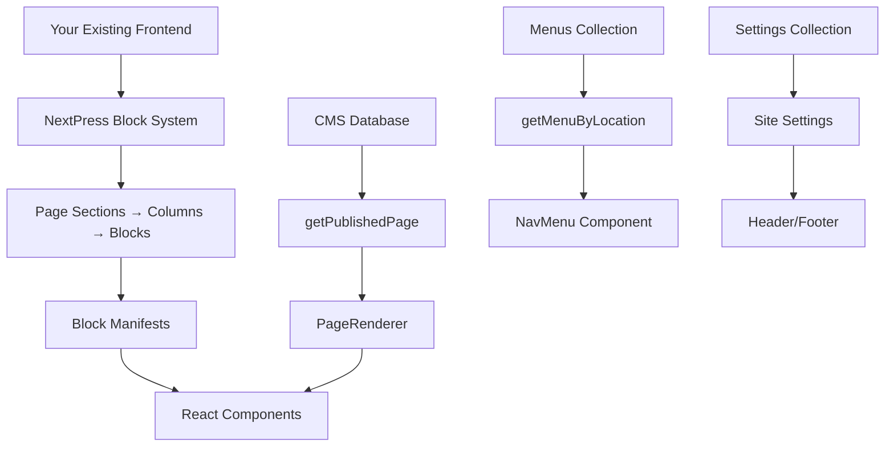

# Integrating an Existing Next.js Frontend into NextPress

A practical step-by-step guide for migrating an existing React/Next.js frontend to use NextPress as its content backend.

---

## Table of Contents

1. [Integration Overview](#1-integration-overview)
2. [Phase 1: Setup and Preparation](#2-phase-1-setup-and-preparation)
3. [Phase 2: Component Migration](#3-phase-2-component-migration)
4. [Phase 3: Data Layer Integration](#4-phase-3-data-layer-integration)
5. [Phase 4: Navigation and Menus](#5-phase-4-navigation-and-menus)
6. [Phase 5: Media and Assets](#6-phase-5-media-and-assets)
7. [Phase 6: Localization](#7-phase-6-localization)
8. [Integration Checklist](#integration-checklist)

---

## 1. Integration Overview

### What You're Doing

When integrating an existing Next.js frontend into NextPress, you're essentially:

1. **Replacing static/hardcoded content** with dynamic data from the CMS
2. **Converting UI sections to block components** that editors can arrange
3. **Using CMS APIs** for navigation, settings, and media instead of config files
4. **Adopting the block-based page builder** for flexible page composition

### Architecture Flow



### Key Integration Points

| Component | Replace With |
|-----------|--------------|
| Static content | `getPublishedPage()` / `getPublishedPost()` |
| Hardcoded nav arrays | `getMenuByLocation()` |
| Config files | Settings collection |
| Static images | Media API + storage providers |
| Hardcoded text | Block content fields |

---

## 2. Phase 1: Setup and Preparation

### Step 1: Initialize NextPress

```bash
# Clone/install NextPress
pnpm install

# Copy environment template
cp .env.example .env

# Edit .env with your database credentials
# DATABASE_URL, DATABASE_URI, AUTH_SECRET, PAYLOAD_SECRET

# Generate schema and run migrations
pnpm schema:generate
pnpm db:migration:run

# Seed initial data
pnpm db:seed

# Start development server
pnpm dev
```

### Step 2: Verify Admin Access

- Admin panel: `http://localhost:3000/admin`
- Login: `admin@example.com` / `Admin1234!`

### Step 3: Understand Your Current Frontend Structure

Map your existing frontend to NextPress:

```
your-project/
├── src/app/              → src/app/(public)/[locale]/
├── src/components/       → src/components/blocks/
├── src/lib/              → src/lib/cms.ts (add helpers)
└── public/               → Keep for static assets
```

### Step 4: Run NextPress Alongside Your Frontend

If you want to keep your existing frontend separate initially:

```bash
# Option A: Run on different ports
# Your frontend: localhost:3001
# NextPress: localhost:3000

# Option B: Run NextPress API only
# Use NextPress as a headless CMS, fetch via REST/GraphQL
# API: http://localhost:3000/api/content
```

---

## 3. Phase 2: Component Migration

### Step 1: Identify UI Sections

List all distinct visual sections in your existing pages:

- Hero banner
- Features grid
- Testimonials
- CTA sections
- FAQ accordions
- Post/product grids
- Contact forms
- Footers

### Step 2: Adapt Components to BlockComponent Signature

Your existing component needs to accept `content` and optionally `data`:

```typescript
// BEFORE: Your existing component
export function HeroBanner({ heading, subheading, ctaText, ctaLink }) {
  return (
    <section className="hero">
      <h1>{heading}</h1>
      <p>{subheading}</p>
      <a href={ctaLink}>{ctaText}</a>
    </section>
  );
}

// AFTER: Block component for NextPress
import type { BlockComponent } from '@/blocks/types';
import { getLocale } from '@/lib/locale-utils';

interface HeroContent {
  heading?: string;
  subheading?: string;
  ctaText?: string;
  ctaLink?: string;
  backgroundImage?: string;
}

export const HeroBannerBlock: BlockComponent = ({ content, locale }) => {
  const c = content as HeroContent;
  
  // Handle both static and locale-first content
  const heading = typeof c.heading === 'object' 
    ? getLocale(c.heading, locale) 
    : c.heading;
  
  return (
    <section 
      className="hero" 
      style={{ backgroundImage: c.backgroundImage ? `url(${c.backgroundImage})` : undefined }}
    >
      <h1>{heading}</h1>
      <p>{c.subheading}</p>
      <a href={c.ctaLink}>{c.ctaText}</a>
    </section>
  );
};
```

### Step 3: Create Block Manifest

```typescript
// src/blocks/manifests/hero-banner.ts
import type { BlockManifest } from '../types';
import { HeroBannerBlock } from '@/components/blocks/HeroBannerBlock';

export const heroBannerManifest: BlockManifest = {
  type: 'hero-banner',
  label: 'Hero Banner',
  icon: 'LayoutTemplate',
  
  definition: {
    content: [
      { name: 'heading', type: 'text', label: 'Heading', required: true },
      { name: 'subheading', type: 'textarea', label: 'Subheading' },
      { name: 'ctaText', type: 'text', label: 'CTA Button Text' },
      { name: 'ctaLink', type: 'text', label: 'CTA URL' },
      { name: 'backgroundImage', type: 'image', label: 'Background Image', size: '1920x1080' },
      {
        name: 'alignment',
        type: 'radio',
        label: 'Text Alignment',
        options: [
          { label: 'Left', value: 'left' },
          { label: 'Center', value: 'center' },
          { label: 'Right', value: 'right' },
        ],
      },
    ],
  },
  
  component: HeroBannerBlock,
};
```

### Step 4: Register in Block Registry

```typescript
// src/blocks/registry.ts
import { heroBannerManifest } from './manifests/hero-banner';

const BUILT_IN_MANIFESTS: BlockManifest[] = [
  heroManifest,
  // ... other manifests
  heroBannerManifest,  // Add your custom block
];
```

### Step 5: Add Type to Blocks Collection

```typescript
// src/collections/Blocks.ts
export const BLOCK_TYPES = [
  { label: 'Hero', value: 'hero' },
  // ... existing types
  { label: 'Hero Banner', value: 'hero-banner' },  // Add your type
] as const;
```

---

## 4. Phase 3: Data Layer Integration

### Step 1: Update Page Templates

Replace static content with CMS data:

```typescript
// src/app/(public)/[locale]/[slug]/page.tsx

import { notFound } from 'next/navigation';
import { getPublishedPage, getPublishedPost } from '@/lib/cms';
import { getLocale } from '@/lib/locale-utils';
import { PageRenderer } from '@/components/blocks/PageRenderer';

export default async function Page({ params }: { params: { locale: string; slug: string } }) {
  const { locale, slug } = await params;
  
  // Try pages first, then posts
  const page = await getPublishedPage(locale, slug);
  const post = await getPublishedPost(locale, slug);
  
  const content = page || post;
  if (!content) notFound();
  
  // Use PageRenderer for block-based pages
  if (page?.sections?.length) {
    return <PageRenderer sections={page.sections} locale={locale} />;
  }
  
  // For posts/pages without sections, render content directly
  return (
    <article>
      <h1>{getLocale(content.title, locale)}</h1>
      <div>{/* Render post content */}</div>
    </article>
  );
}
```

### Step 2: Add CMS Helpers

Extend `src/lib/cms.ts` with helpers for your content:

```typescript
// src/lib/cms.ts

// Example: Helper for your custom content type
export async function getPublishedProject(slug: string) {
  return prisma.projects.findFirst({
    where: {
      status: 'published',
      slug: { path: ['en'], equals: slug },
    },
    include: {
      featuredImage: true,
      category: true,
    },
  });
}

export async function getPublishedProjects(options?: {
  limit?: number;
  category?: string;
}) {
  const where: any = { status: 'published' };
  
  if (options?.category) {
    where.category = { slug: options.category };
  }
  
  return prisma.projects.findMany({
    where,
    take: options?.limit ?? 10,
    orderBy: { createdAt: 'desc' },
    include: {
      featuredImage: true,
    },
  });
}
```

### Step 3: Create a Custom Collection (If Needed)

For content types beyond pages and posts:

```typescript
// src/collections/Projects.ts
import { CollectionConfig } from '../core/collection';

export const Projects: CollectionConfig<'projects'> = {
  slug: 'projects',
  
  labels: {
    singular: 'Project',
    plural: 'Projects',
  },
  
  admin: {
    useAsTitle: 'name',
    group: 'content',
  },
  
  fields: [
    {
      name: 'name',
      type: 'text',
      required: true,
    },
    {
      name: 'slug',
      type: 'json',
      localized: true,
      required: true,
    },
    {
      name: 'description',
      type: 'json',
      localized: true,
    },
    {
      name: 'content',
      type: 'json',
      localized: true,
    },
    {
      name: 'featuredImage',
      type: 'upload',
      relationTo: 'media',
    },
    {
      name: 'category',
      type: 'relationship',
      relationTo: 'categories',
    },
    {
      name: 'status',
      type: 'select',
      options: [
        { label: 'Draft', value: 'draft' },
        { label: 'Published', value: 'published' },
      ],
      defaultValue: 'draft',
    },
  ],
  
  access: {
    read: () => true,
    create: ({ req }) => !!req.user,
    update: ({ req }) => !!req.user,
    delete: ({ req }) => req.user?.role === 'admin',
  },
};
```

Register in `src/collections/index.ts`:

```typescript
import { Projects } from './Projects';

export const collections = [
  // ... existing collections
  Projects,
];
```

Then regenerate the schema:

```bash
pnpm schema:generate
pnpm db:migration:run
```

---

## 5. Phase 4: Navigation and Menus

### Step 1: Replace Hardcoded Nav

```typescript
// src/app/(public)/layout.tsx

import { getMenuByLocation } from '@/lib/cms';
import { NavMenu } from '@/components/public/NavMenu';

export default async function PublicLayout({ children }) {
  const primaryMenu = await getMenuByLocation('primary');
  const footerMenu = await getMenuByLocation('footer');
  
  return (
    <html>
      <body>
        <header>
          <NavMenu menu={primaryMenu} orientation="horizontal" />
        </header>
        <main>{children}</main>
        <footer>
          <NavMenu menu={footerMenu} orientation="vertical" />
        </footer>
      </body>
    </html>
  );
}
```

### Step 2: Create Custom NavMenu (If Needed)

```typescript
// src/components/public/MyNavMenu.tsx

import type { MenuWithItems } from '@/lib/cms';

export function MyNavMenu({ menu }: { menu: MenuWithItems | null }) {
  if (!menu) return null;
  
  return (
    <nav className="my-nav">
      {menu.items.map((item) => (
        <div key={item.id} className="nav-item">
          <a href={item.url ?? `/${item.slugsByLocale?.en}`}>
            {item.label}
          </a>
          {item.children?.length > 0 && (
            <div className="dropdown">
              {item.children.map((child) => (
                <a key={child.id} href={child.url ?? `/${child.slugsByLocale?.en}`}>
                  {child.label}
                </a>
              ))}
            </div>
          )}
        </div>
      ))}
    </nav>
  );
}
```

### Step 3: Add Menu Locations

1. Go to Admin → Menus
2. Create new menus with locations: `primary`, `footer`, `mobile`, etc.
3. Add menu items with page references or custom URLs

---

## 6. Phase 5: Media and Assets

### Step 1: Migrate Static Images to Media Library

1. Upload images via Admin → Media
2. Copy the returned URLs
3. Update your components to use dynamic URLs

### Step 2: Update Image Components

```typescript
// Before: Static import
import heroImage from '@/public/images/hero.jpg';

// After: Dynamic from CMS
function HeroSection({ imageUrl }: { imageUrl: string }) {
  return (
    <Image 
      src={imageUrl}
      alt="Hero"
      width={1920}
      height={1080}
    />
  );
}
```

### Step 3: Configure Storage Provider

NextPress supports multiple storage backends. To switch:

```bash
# .env
NEXTPRESS_STORAGE_PROVIDER=local    # default
# or
NEXTPRESS_STORAGE_PROVIDER=s3
NEXTPRESS_STORAGE_PROVIDER=supabase
NEXTPRESS_STORAGE_PROVIDER=cloudinary
```

---

## 7. Phase 6: Localization

### Step 1: Configure Locales

In `src/nextpress.config.ts`:

```typescript
localization: {
  locales: [
    { code: 'en', label: 'English' },
    { code: 'fr', label: 'Français' },
    { code: 'de', label: 'Deutsch' },
    { code: 'es', label: 'Español' },
  ],
  defaultLocale: 'en',
  fallback: true,
}
```

### Step 2: Update Components for Localization

```typescript
import { getLocale } from '@/lib/locale-utils';

// Reading locale-first content
const title = getLocale(block.content.heading, locale);
const description = getLocale(block.content.description, locale);
```

### Step 3: Add Language Switcher

```typescript
import { getLocaleAlternates } from '@/lib/locale-utils';

export function LanguageSwitcher({ currentSlug }: { currentSlug: Record<string, string> }) {
  const alternates = getLocaleAlternates(currentSlug);
  
  return (
    <ul>
      {alternates.map(({ locale, slug }) => (
        <li key={locale}>
          <a href={`/${locale}/${slug}`}>{locale.toUpperCase()}</a>
        </li>
      ))}
    </ul>
  );
}
```

---

## Integration Checklist

Use this checklist to track your integration progress:

### Phase 1: Setup
- [ ] NextPress installed and running
- [ ] Database migrated and seeded
- [ ] Admin accessible
- [ ] Frontend code reviewed and mapped

### Phase 2: Components
- [ ] UI sections identified (list all sections)
- [ ] Block manifests created for each section
- [ ] Components adapted to BlockComponent signature
- [ ] Types added to Blocks collection

### Phase 3: Data
- [ ] Page templates updated to fetch from CMS
- [ ] Custom collections created (if needed)
- [ ] CMS helpers added to cms.ts

### Phase 4: Navigation
- [ ] Hardcoded menus replaced with CMS menus
- [ ] Menu locations configured in admin

### Phase 5: Media
- [ ] Static images migrated to media library
- [ ] Image components updated to use dynamic URLs

### Phase 6: Localization
- [ ] Locales configured in nextpress.config.ts
- [ ] Components updated with getLocale()
- [ ] Language switcher implemented

### Final Verification
- [ ] All pages render correctly
- [ ] Admin can create/edit pages with blocks
- [ ] Navigation works
- [ ] Media displays properly
- [ ] Localization switches correctly

---

## Quick Reference

### Key Files

| File | Purpose |
|------|---------|
| `src/lib/cms.ts` | Data fetching helpers |
| `src/blocks/registry.ts` | Block type registration |
| `src/blocks/manifests/*.ts` | Block definitions |
| `src/collections/*.ts` | Content type definitions |
| `src/app/(public)/` | Public-facing pages |
| `src/nextpress.config.ts` | Main configuration |

### Key Functions

```typescript
import {
  getPublishedPage,    // Fetch a page by slug
  getPublishedPost,    // Fetch a post by slug
  getPublishedPosts,   // Fetch multiple posts
  getMenuByLocation,   // Fetch menu by location
  getBlocksByIds,      // Fetch blocks for page rendering
  queryCollection,     // Query any collection
  getLocale,           // Extract localized value
  getLocaleAlternates, // Get alternate language URLs
} from '@/lib/cms';
```

### Common Issues

1. **Blocks not showing**: Check block type is in `BLOCK_TYPES` array
2. **Content not loading**: Verify status is 'published' in database
3. **Locale issues**: Ensure locale code matches config
4. **Images not appearing**: Check media is uploaded and URL is correct

---

## Next Steps

After integration:

1. **Build out remaining block types** for your UI sections
2. **Add more collections** for custom content types
3. **Configure RBAC** for team members
4. **Set up preview mode** for draft content
5. **Deploy to production** with appropriate storage provider

For more details, see:
- [UI Integration Guide](../docs/ui-integration-guide.md)
- [Developer Guide](../docs/developer-guide.md)
- [Block System Documentation](../docs/developer-guide.md#7-block-system)
