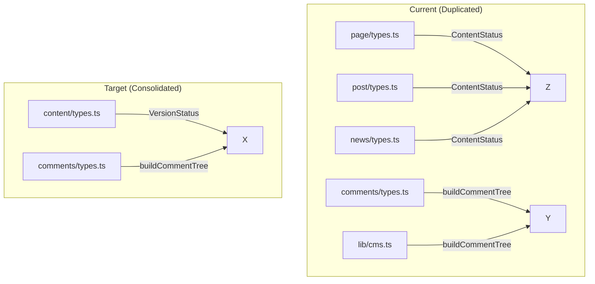

# Kernel Cleanup & Refactoring Plan

## Identified Issues

### 1. Duplicate Type Definitions

| Issue | Files | Problem |
|-------|-------|---------|
| `VersionStatus` vs `ContentStatus` | [`src/kernel/content/types.ts`](src/kernel/content/types.ts) vs [`src/kernel/page/types.ts`](src/kernel/page/types.ts) | Both define `'DRAFT' \| 'PUBLISHED' \| 'SCHEDULED' \| 'ARCHIVED'` |
| Duplicate content interfaces | `page/types.ts`, `post/types.ts`, `news/types.ts` | Nearly identical `Page`/`Post`/`News`, `PageLocale`/`PostLocale`/`NewsLocale`, `PageVersion`/`PostVersion`/`NewsVersion` |
| Duplicate repository interfaces | Same 3 files | Identical `PageRepository`, `PostRepository`, `NewsRepository` patterns |

### 2. Duplicate Helper Functions

| Function | Files | Location |
|----------|-------|----------|
| `buildCommentTree` | [`src/kernel/comments/types.ts:94`](src/kernel/comments/types.ts), [`src/lib/cms.ts:347`](src/lib/cms.ts) | Duplicated |
| `getLocalizedLabel` / `getLocalizedField` | [`src/kernel/navigation/types.ts:141`](src/kernel/navigation/types.ts), [`src/lib/cms.ts:450`](src/lib/cms.ts) | Duplicated |

### 3. Dead Code / Broken Imports

- [`src/kernel/schema/canonical/schema.ts`](src/kernel/schema/canonical/schema.ts): Imports `ModelSchema` and `EnumSchema` which don't exist
- Empty directories: `schema/generators/`, `schema/validators/`, `views/`

### 4. Inconsistent Patterns

- Permission actions defined in multiple places (`ContentAction`, `SchemaAction`, `UserAction`)
- Each content type has its own file instead of a shared base
- Export patterns inconsistent (some use index.ts re-exports, some don't)

---

## Refactoring Steps

### Phase 1: Consolidate Core Types (Priority: High)

1. **Unify status type**
   - Keep `VersionStatus` in `content/types.ts`
   - Remove duplicate `ContentStatus` from `page/types.ts` 
   - Update imports in `post/types.ts`, `news/types.ts`

2. **Create shared content base**
   - Create `BaseContent` interface in `content/types.ts`
   - Create `BaseLocale` interface
   - Create `BaseVersion` interface
   - Use generics or type aliases in individual type files

### Phase 2: Remove Duplicates (Priority: High)

3. **Remove duplicate helper functions**
   - Keep `buildCommentTree` in `comments/types.ts`
   - Remove from `lib/cms.ts`, use kernel version

4. **Remove duplicate localization helpers**
   - Keep `getLocalizedLabel` in `navigation/types.ts`
   - Remove `getLocalizedField` from `lib/cms.ts`

### Phase 3: Clean Up Dead Code (Priority: Medium)

5. **Fix broken canonical schema**
   - Either implement `ModelSchema` and `EnumSchema`
   - Or remove `schema/canonical/` directory entirely

6. **Remove empty directories**
   - Delete `schema/generators/`
   - Delete `schema/validators/`
   - Delete `views/`

### Phase 4: Optimize RBAC Engine (Priority: Medium)

7. **Performance improvements**
   - Cache computed permissions per principal
   - Use early returns to avoid unnecessary iterations

8. **Consolidate permission types**
   - Move `ContentAction`, `SchemaAction`, `UserAction` to single location
   - Create union type `Action` properly

### Phase 5: Consistency (Priority: Low)

9. **Standardize exports**
   - Ensure all modules use index.ts pattern
   - Remove legacy exports from kernel index

10. **Document types**
    - Add JSDoc to key interfaces

---

## Mermaid: Current State vs Target

---

## Implementation Order

1. **Step 1**: Fix `VersionStatus` vs `ContentStatus` duplication
2. **Step 2**: Create base content interfaces
3. **Step 3**: Remove duplicate helper functions
4. **Step 4**: Clean up dead code
5. **Step 5**: Optimize RBAC engine
6. **Step 6**: Standardize exports

---

## Risk Assessment

| Step | Risk | Mitigation |
|------|------|------------|
| Consolidating types | Breaking existing imports | Update all imports atomically |
| Removing duplicates | Runtime errors if not updated | Test after each change |
| RBAC optimization | Permission bypass | Ensure logic equivalence |

---

## Files to Modify

- `src/kernel/content/types.ts` - Add base interfaces
- `src/kernel/page/types.ts` - Use shared types, remove duplicate
- `src/kernel/post/types.ts` - Use shared types
- `src/kernel/news/types.ts` - Use shared types
- `src/kernel/comments/types.ts` - Export for use in lib/cms.ts
- `src/kernel/navigation/types.ts` - Export for use in lib/cms.ts
- `src/lib/cms.ts` - Remove duplicates, use kernel imports
- `src/kernel/schema/canonical/schema.ts` - Fix or remove
- `src/kernel/permissions/rbac-engine.ts` - Optimize
- `src/kernel/index.ts` - Clean up exports

---

## Files to Delete

- `src/kernel/schema/generators/` (if empty)
- `src/kernel/schema/validators/` (if empty)
- `src/kernel/views/` (if empty)
