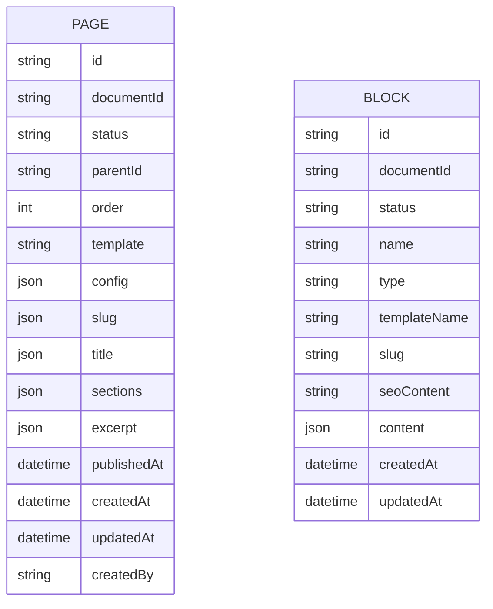

# Pages and Blocks System Plan

## Overview

This document outlines the architecture for a page builder system where:
- **Pages** contain **Sections** (JSON)
- **Sections** contain **Columns** (JSON)
- **Columns** contain references to **Blocks** (database records)
- **Localized fields stored as JSON** within the same table (not separate locale tables)
- **Block content is localized** (stored as JSON in the Block table)

## Data Structure

### Page Hierarchy

```
Page
├── config (JSON) - page configuration
├── slug (JSON) - { "en": "about", "fr": "a-propos" }
├── sections (JSON) - array of Section objects
│   └── SectionName
│       └── columns (JSON) - array of Column objects
│           └── Column
│               └── blocks (JSON) - array of BlockReference objects
│                   └── BlockReference { blockId, order }
└── Block[] (referenced)
    └── content (JSON) - localized content { "en": {...}, "fr": {...} }
```

### JSON Structures

#### Page Table Fields
```prisma
model Page {
  id            String    @id @default(uuid())
  documentId    String
  status        String    @db.VarChar(20)
  parentId      String?
  order         Int       @default(0)
  template      String?   @db.VarChar(100)
  config        Json?     // Page configuration
  
  // Localized fields as JSON
  slug          Json      // { "en": "about", "fr": "a-propos" }
  title         Json      // { "en": "About", "fr": "À propos" }
  sections      Json?     // Array of Section objects with columns and block refs
  excerpt       Json?     // { "en": "...", "fr": "..." }
  
  publishedAt   DateTime?
  scheduledAt   DateTime?
  createdAt     DateTime  @default(now())
  updatedAt     DateTime  @updatedAt
  createdBy     String    @db.VarChar(255)

  parent        Page?     @relation("PageHierarchy", fields: [parentId], references: [id])
  children      Page[]    @relation("PageHierarchy")
  blocks        PageBlock[]
  
  @@unique([documentId, status])
  @@index([status])
  @@map("page")
}
```

#### Section (stored in Page.sections)
```json
[
  {
    "id": "uuid",
    "name": "hero-section",
    "templateName": "hero-full-width",
    "settings": { "fullWidth": true, "backgroundColor": "#fff", "padding": "large" },
    "columns": [
      {
        "id": "uuid",
        "width": "col-12",
        "blocks": [
          { "blockId": "uuid-of-block", "order": 0 }
        ]
      }
    ]
  }
]
```

#### Column (stored in Section.columns)
```json
{
  "id": "uuid",
  "width": "col-8",
  "offset": "col-offset-2",
  "blocks": [
    { "blockId": "uuid-of-block", "order": 0 },
    { "blockId": "uuid-of-block", "order": 1 }
  ]
}
```

#### BlockReference (stored in Column.blocks)
```json
{ "blockId": "uuid-of-block", "order": 0 }
```

## Database Schema (Prisma)

### Page Model (Updated)
```prisma
model Page {
  id            String    @id @default(uuid())
  documentId    String
  status        String    @db.VarChar(20)
  parentId      String?
  order         Int       @default(0)
  template      String?   @db.VarChar(100)
  config        Json?     // Page configuration
  
  // Localized fields stored as JSON
  slug          Json      // { "en": "about", "fr": "a-propos" }
  title         Json      // { "en": "About", "fr": "À propos" }
  sections      Json?     // Array of Section objects
  excerpt       Json?     // { "en": "...", "fr": "..." }
  
  publishedAt   DateTime?
  scheduledAt   DateTime?
  createdAt     DateTime  @default(now())
  updatedAt     DateTime  @updatedAt
  createdBy     String    @db.VarChar(255)

  parent        Page?     @relation("PageHierarchy", fields: [parentId], references: [id])
  children      Page[]    @relation("PageHierarchy")
  blocks        PageBlock[]
  
  @@unique([documentId, status])
  @@index([status])
  @@index([parentId])
  @@map("page")
}
```

### Block Model
```prisma
model Block {
  id           String   @id @default(uuid())
  documentId   String   // For versioning (draft/published)
  status       String   @db.VarChar(20)
  name         String   @unique @db.VarChar(255)  // Unique internal name
  type         String   @db.VarChar(100)  // block type (hero, text, gallery, etc.)
  templateName String?  @db.VarChar(255)  // template identifier
  slug         String?  @db.VarChar(255)  // URL-friendly name (optional)
  seoContent   String?  @db.Text  // SEO content
  
  // Localized content stored as JSON
  content      Json     // { "en": { "heading": "...", "text": "..." }, "fr": { ... } }
  
  createdAt    DateTime @default(now())
  updatedAt    DateTime @updatedAt
  
  @@unique([documentId, status])
  @@index([status])
  @@index([type])
  @@index([name])
  @@map("block")
}
```

## Block Content Structure

Each block's content is stored as localized JSON:

```json
{
  "en": {
    "heading": "Welcome to Our Site",
    "subheading": "We provide amazing services",
    "backgroundImage": { "url": "/uploads/hero.jpg", "alt": "Hero image" },
    "ctaText": "Learn More",
    "ctaLink": "/about",
    "alignment": "center"
  },
  "fr": {
    "heading": "Bienvenue sur notre site",
    "subheading": "Nous fournissons des services incroyables",
    "backgroundImage": { "url": "/uploads/hero.jpg", "alt": "Image héro" },
    "ctaText": "En savoir plus",
    "ctaLink": "/fr/a-propos",
    "alignment": "center"
  }
}
```

## Implementation Tasks

### Phase 1: Database Schema

Update `src/adapters/prisma-adapter/prisma/schema_.prisma`:

```prisma
// Page model - add/update fields for localization
model Page {
  id            String    @id @default(uuid())
  documentId    String
  status        String    @db.VarChar(20) @default("draft")
  parentId      String?
  order         Int       @default(0)
  template      String?   @db.VarChar(100)
  config        Json?     // { "layout": "full-width", "theme": "dark" }
  
  // Localized fields stored as JSON - { "en": "value", "fr": "valeur" }
  slug          Json      // { "en": "about", "fr": "a-propos" }
  title         Json      // { "en": "About", "fr": "À propos" }
  sections      Json?     // [ { "name": "hero", "columns": [...] } ]
  excerpt       Json?     // { "en": "...", "fr": "..." }
  
  publishedAt   DateTime?
  scheduledAt   DateTime?
  createdAt     DateTime  @default(now())
  updatedAt     DateTime  @updatedAt
  createdBy     String    @db.VarChar(255)

  parent        Page?     @relation("PageHierarchy", fields: [parentId], references: [id])
  children      Page[]    @relation("PageHierarchy")
  
  @@unique([documentId, status])
  @@index([status])
  @@index([parentId])
  @@map("page")
}

// Block model - separate table for reusable blocks
model Block {
  id           String   @id @default(uuid())
  documentId   String
  status       String   @db.VarChar(20) @default("draft")
  name         String   @unique @db.VarChar(255)  // Unique internal name (e.g., "hero-home")
  type         String   @db.VarChar(100)  // block type: hero, text, gallery, etc.
  templateName String?  @db.VarChar(255)  // template: "hero-full-width"
  slug         String?  @db.VarChar(255)  // URL-friendly: "hero-section"
  seoContent   String?  @db.Text  // SEO content
  
  // Localized content - { "en": { "heading": "..." }, "fr": { ... } }
  content      Json     // Block content key-value pairs per locale
  
  createdAt    DateTime @default(now())
  updatedAt    DateTime @updatedAt
  
  @@unique([documentId, status])
  @@index([status])
  @@index([type])
  @@index([name])
  @@map("block")
}
```

### Phase 2: Collection Configuration

Create `src/collections/Blocks.ts`:

```typescript
import {
  CollectionConfig,
  CollectionTextField,
  CollectionTextareaField,
  SelectField,
  JSONField,
} from '../core/collection';

// Block type options
export const BLOCK_TYPES = [
  { label: 'Hero', value: 'hero' },
  { label: 'Text', value: 'text' },
  { label: 'Image', value: 'image' },
  { label: 'Gallery', value: 'gallery' },
  { label: 'Video', value: 'video' },
  { label: 'Columns', value: 'columns' },
  { label: 'Call to Action', value: 'cta' },
  { label: 'Accordion', value: 'accordion' },
  { label: 'Carousel', value: 'carousel' },
  { label: 'Map', value: 'map' },
] as const;

export const Blocks: CollectionConfig<'blocks'> = {
  slug: 'blocks',
  
  labels: {
    singular: 'Block',
    plural: 'Blocks',
  },
  
  admin: {
    useAsTitle: 'name',
    defaultColumns: ['name', 'type', 'templateName', 'createdAt'],
    group: 'Content',
  },
  
  access: {
    read: ({ req }) => {
      if (req.user?.role === 'admin') return true;
      return { status: { equals: 'published' } };
    },
    create: ({ req }) => req.user?.role === 'admin' || req.user?.role === 'editor',
    update: ({ req }) => req.user?.role === 'admin' || req.user?.role === 'editor',
    delete: ({ req }) => req.user?.role === 'admin',
  },
  
  fields: [
    {
      name: 'name',
      type: 'text',
      required: true,
      unique: true,
      admin: {
        description: 'Unique internal name (e.g., hero-home, footer-contact)',
      },
    } satisfies CollectionTextField,
    {
      name: 'type',
      type: 'select',
      required: true,
      options: BLOCK_TYPES,
      admin: {
        description: 'Block type determines the template and fields',
      },
    } satisfies SelectField,
    {
      name: 'templateName',
      type: 'text',
      admin: {
        description: 'Template identifier (e.g., hero-full-width, cta-button)',
      },
    } satisfies CollectionTextField,
    {
      name: 'slug',
      type: 'text',
      admin: {
        description: 'URL-friendly identifier (optional)',
      },
    } satisfies CollectionTextField,
    {
      name: 'content',
      type: 'json',
      required: true,
      defaultValue: { en: {}, fr: {}, de: {} },
      admin: {
        description: 'Localized content key-value pairs per block type',
      },
    } satisfies JSONField,
    {
      name: 'seoContent',
      type: 'textarea',
      admin: {
        description: 'SEO content for this block',
      },
    } satisfies CollectionTextareaField,
    {
      name: 'status',
      type: 'select',
      required: true,
      defaultValue: 'draft',
      options: [
        { label: 'Draft', value: 'draft' },
        { label: 'Published', value: 'published' },
      ],
    } satisfies SelectField,
  ],
  
  versions: {
    enabled: true,
    maxPerDoc: 10,
  },
  
  indexes: [
    { fields: ['name'], unique: true },
    { fields: ['type'] },
    { fields: ['status'] },
  ],
};
```

Update `src/collections/Pages.ts`:

```typescript
import {
  CollectionConfig,
  CollectionTextField,
  CollectionTextareaField,
  SelectField,
  UploadField,
  GroupField,
  JSONField,
  ArrayField,
} from '../core/collection';

// Section array field for the page builder
export const SectionArrayField = {
  name: 'sections',
  type: 'array',
  admin: {
    description: 'Page sections with columns and block references',
  },
  fields: [
    {
      name: 'id',
      type: 'text',
      required: true,
    } satisfies CollectionTextField,
    {
      name: 'name',
      type: 'text',
      required: true,
      admin: { description: 'Section identifier' },
    } satisfies CollectionTextField,
    {
      name: 'templateName',
      type: 'text',
      admin: { description: 'Section template' },
    } satisfies CollectionTextField,
    {
      name: 'settings',
      type: 'json',
      admin: { description: 'Section settings' },
    } satisfies JSONField,
    {
      name: 'columns',
      type: 'array',
      fields: [
        {
          name: 'id',
          type: 'text',
          required: true,
        } satisfies CollectionTextField,
        {
          name: 'width',
          type: 'text',
          admin: { description: 'Bootstrap class e.g., col-8' },
        } satisfies CollectionTextField,
        {
          name: 'offset',
          type: 'text',
          admin: { description: 'Offset class e.g., col-offset-2' },
        } satisfies CollectionTextField,
        {
          name: 'blocks',
          type: 'array',
          fields: [
            {
              name: 'blockId',
              type: 'text',
              required: true,
              admin: { description: 'Reference to Block ID' },
            } satisfies CollectionTextField,
            {
              name: 'order',
              type: 'number',
              required: true,
              defaultValue: 0,
            },
          ],
        } satisfies ArrayField,
      ],
    } satisfies ArrayField,
  ],
} satisfies ArrayField;

export const Pages: CollectionConfig<'pages'> = {
  slug: 'pages',
  
  labels: {
    singular: 'Page',
    plural: 'Pages',
  },
  
  admin: {
    useAsTitle: 'title',
    defaultColumns: ['title', 'slug', 'status', 'createdAt'],
    group: 'Content',
  },
  
  access: {
    read: ({ req }) => {
      if (req.user?.role === 'admin') return true;
      return { status: { equals: 'published' } };
    },
    create: ({ req }) => req.user?.role === 'admin' || req.user?.role === 'editor',
    update: ({ req }) => req.user?.role === 'admin' || req.user?.role === 'editor',
    delete: ({ req }) => req.user?.role === 'admin',
  },
  
  fields: [
    {
      name: 'config',
      type: 'json',
      admin: {
        description: 'Page configuration (layout, theme, etc.)',
      },
    } satisfies JSONField,
    {
      name: 'title',
      type: 'json',  // Localized: { "en": "About", "fr": "À propos" }
      required: true,
      admin: {
        description: 'Page title (localized)',
      },
    } satisfies JSONField,
    {
      name: 'slug',
      type: 'json',  // Localized: { "en": "about", "fr": "a-propos" }
      required: true,
      admin: {
        description: 'URL slug (localized)',
      },
    } satisfies JSONField,
    {
      name: 'sections',
      type: 'array',
      admin: {
        description: 'Page sections with columns and block references',
      },
      fields: [
        {
          name: 'id',
          type: 'text',
          required: true,
        } satisfies CollectionTextField,
        {
          name: 'name',
          type: 'text',
          required: true,
        } satisfies CollectionTextField,
        {
          name: 'templateName',
          type: 'text',
        } satisfies CollectionTextField,
        {
          name: 'settings',
          type: 'json',
        } satisfies JSONField,
        {
          name: 'columns',
          type: 'array',
          fields: [
            {
              name: 'id',
              type: 'text',
              required: true,
            } satisfies CollectionTextField,
            {
              name: 'width',
              type: 'text',
            } satisfies CollectionTextField,
            {
              name: 'offset',
              type: 'text',
            } satisfies CollectionTextField,
            {
              name: 'blocks',
              type: 'array',
              fields: [
                {
                  name: 'blockId',
                  type: 'text',
                  required: true,
                } satisfies CollectionTextField,
                {
                  name: 'order',
                  type: 'number',
                  required: true,
                  defaultValue: 0,
                },
              ],
            } satisfies ArrayField,
          ],
        } satisfies ArrayField,
      ],
    } satisfies ArrayField,
    {
      name: 'excerpt',
      type: 'json',  // Localized
      admin: {
        description: 'Short description (localized)',
      },
    } satisfies JSONField,
    {
      name: 'status',
      type: 'select',
      required: true,
      defaultValue: 'draft',
      options: [
        { label: 'Draft', value: 'draft' },
        { label: 'Published', value: 'published' },
        { label: 'Archived', value: 'archived' },
      ],
    } satisfies SelectField,
    {
      name: 'featuredImage',
      type: 'upload',
      relationTo: 'media',
    } satisfies UploadField,
  ],
  
  versions: {
    enabled: true,
    maxPerDoc: 10,
  },
  
  indexes: [
    { fields: ['status'] },
  ],
};
```

### Phase 3: API Endpoints

Create routes for Blocks management:

```typescript
// src/app/api/admin/blocks/route.ts
import { NextRequest, NextResponse } from 'next/server';
import { prisma } from '@/adapters/prisma-adapter';

export async function GET(request: NextRequest) {
  const { searchParams } = new URL(request.url);
  const type = searchParams.get('type');
  const status = searchParams.get('status') || 'published';
  
  const where: any = { status };
  if (type) where.type = type;
  
  const blocks = await prisma.block.findMany({ where });
  return NextResponse.json({ blocks });
}

export async function POST(request: NextRequest) {
  const body = await request.json();
  const { name, type, templateName, slug, content, seoContent, status } = body;
  
  const documentId = crypto.randomUUID();
  
  const block = await prisma.block.create({
    data: {
      documentId,
      name,
      type,
      templateName,
      slug,
      content: content || { en: {}, fr: {}, de: {} },
      seoContent,
      status: status || 'draft',
    },
  });
  
  return NextResponse.json({ block }, { status: 201 });
}
```

```typescript
// src/app/api/admin/blocks/[id]/route.ts
import { NextRequest, NextResponse } from 'next/server';
import { prisma } from '@/adapters/prisma-adapter';

export async function GET(
  request: NextRequest,
  { params }: { params: { id: string } }
) {
  const block = await prisma.block.findUnique({
    where: { id: params.id },
  });
  
  if (!block) {
    return NextResponse.json({ error: 'Block not found' }, { status: 404 });
  }
  
  return NextResponse.json({ block });
}

export async function PUT(
  request: NextRequest,
  { params }: { params: { id: string } }
) {
  const body = await request.json();
  
  const block = await prisma.block.update({
    where: { id: params.id },
    data: body,
  });
  
  return NextResponse.json({ block });
}

export async function DELETE(
  request: NextRequest,
  { params }: { params: { id: string } }
) {
  await prisma.block.delete({
    where: { id: params.id },
  });
  
  return NextResponse.json({ success: true });
}
```

### Phase 4: Admin UI

1. **Create Section Editor Component** (`src/components/admin/SectionEditor/`)
   - SectionList.tsx - Drag-and-drop reordering of sections
   - SectionEdit.tsx - Edit section name, template, settings
   - ColumnEditor.tsx - Add/remove columns, set width/offset
   - BlockReference.tsx - Show block preview, remove reference

2. **Create Block Picker Component** (`src/components/admin/BlockPicker/`)
   - BlockPicker.tsx - Modal to select existing blocks
   - BlockTypeFilter.tsx - Filter by block type
   - BlockPreview.tsx - Preview block content

3. **Create Block Editor Component** (`src/components/admin/BlockEditor/`)
   - BlockEditor.tsx - Main editor with tabs for each locale
   - ContentFieldEditor.tsx - Dynamic fields based on block type
   - seoEditor.tsx - SEO content fields

4. **Localized Field Component** (`src/components/admin/LocalizedField/`)
   - LocalizedInput.tsx - Text input with locale tabs
   - LocalizedTextarea.tsx - Textarea with locale tabs
   - LocalizedJSON.tsx - JSON editor with locale tabs

### Phase 5: Rendering

Create block rendering system:

```typescript
// src/components/blocks/registry.ts
import { HeroBlock } from './HeroBlock';
import { TextBlock } from './TextBlock';
import { ImageBlock } from './ImageBlock';
import { CTABlock } from './CTABlock';
// ... other blocks

export const BlockRegistry = {
  hero: HeroBlock,
  text: TextBlock,
  image: ImageBlock,
  cta: CTABlock,
  // ...
};

export function getBlockComponent(type: string) {
  return BlockRegistry[type] || null;
}
```

```typescript
// src/components/blocks/PageRenderer.tsx
import { getBlockComponent } from './registry';

export function PageRenderer({ 
  sections, 
  locale 
}: { 
  sections: Section[], 
  locale: string 
}) {
  return (
    <>
      {sections.map((section) => (
        <SectionRenderer 
          key={section.id} 
          section={section} 
          locale={locale} 
        />
      ))}
    </>
  );
}

function SectionRenderer({ section, locale }: { section: Section; locale: string }) {
  const BlockComponent = getBlockComponent(section.templateName);
  
  return (
    <section data-section={section.name}>
      <div className="container">
        <div className="row">
          {section.columns.map((column) => (
            <div 
              key={column.id} 
              className={`${column.width} ${column.offset || ''}`}
            >
              {column.blocks
                .sort((a, b) => a.order - b.order)
                .map((blockRef) => (
                  <BlockRenderer
                    key={blockRef.blockId}
                    blockId={blockRef.blockId}
                    locale={locale}
                  />
                ))}
            </div>
          ))}
        </div>
      </div>
    </section>
  );
}

async function BlockRenderer({ blockId, locale }: { blockId: string; locale: string }) {
  const block = await getBlockById(blockId);
  if (!block) return null;
  
  const BlockComponent = getBlockComponent(block.type);
  if (!BlockComponent) return <div>Unknown block type: {block.type}</div>;
  
  const content = block.content?.[locale] || block.content?.en || {};
  
  return <BlockComponent content={content} block={block} />;
}
```

Example block component:

```typescript
// src/components/blocks/HeroBlock.tsx
import React from 'react';

export function HeroBlock({ content, block }: { content: any; block: Block }) {
  return (
    <div className="hero-block" style={{ 
      backgroundImage: content.backgroundImage ? `url(${content.backgroundImage})` : undefined 
    }}>
      <h1>{content.heading}</h1>
      {content.subheading && <p>{content.subheading}</p>}
      {content.ctaText && (
        <a href={content.ctaLink} className="cta-button">
          {content.ctaText}
        </a>
      )}
    </div>
  );
}
```

## Block Types (Initial)

| Type | Description |
|------|-------------|
| hero | Hero banner section |
| text | Rich text block |
| image | Image with caption |
| gallery | Image gallery |
| video | Video embed |
| columns | Multi-column content |
| cta | Call to action |
| accordion | FAQ accordion |
| carousel | Content carousel |
| map | Google/Map embed |

## Mermaid Diagram



## Localization Pattern

All localized fields follow this JSON structure in the database:

```json
{
  "en": "English value",
  "fr": "French value",
  "de": "German value"
}
```

This applies to:
- `Page.slug`
- `Page.title`
- `Page.excerpt`
- `Page.sections` (contains localized content references)
- `Block.content`

## Next Steps

1. Confirm plan with stakeholders
2. Begin Phase 1: Database schema implementation
3. Create migration script
