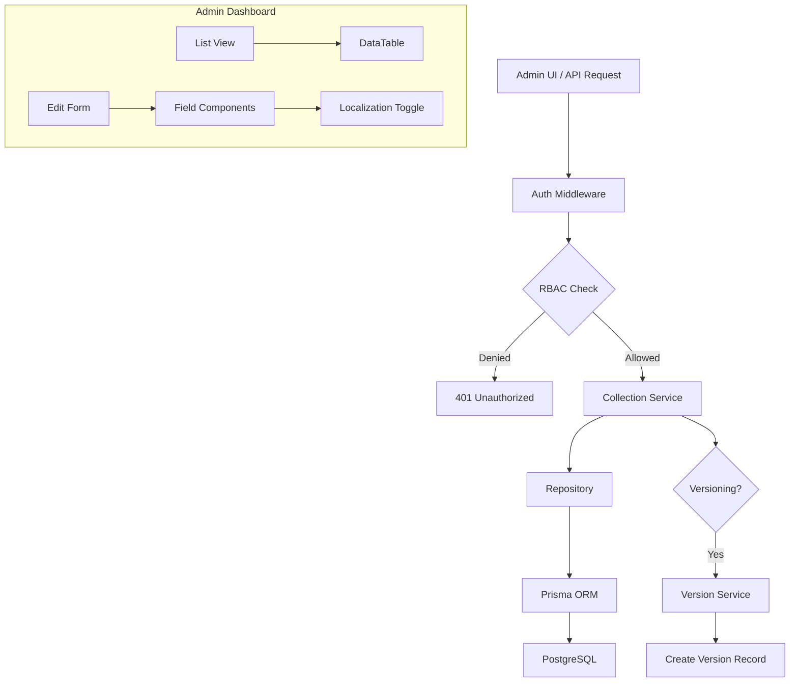

# Payload CMS Collections Integration Plan

## Overview

Convert the 9 Payload CMS collections to Prisma schema, create database migrations, build data access APIs, and generate admin dashboard components.

## Collections to Convert

| Collection | Fields | Localization | Status |
|------------|--------|--------------|--------|
| Products | name, model, slug, description, shortDescription, category, media, specifications, inStock, featured, order, instructions | Yes | Pending |
| Categories | name, slug, description, image, icon, parentCategory, media, order | Yes | Pending |
| Users | role, name (auth enabled) | No | Pending |
| Media | alt (upload enabled) | No | Pending |
| Pages | title, slug, content, metaDescription | Yes | Pending |
| Countries | name, code, coordinates, flag, color, description, symbol, background, wallpaper, offices | Yes | Pending |
| HeroSlides | title, subtitle, mediaType, image, mobileImage, videoUrl, youtubeId, ctaText, ctaLink, textPosition, textColor, overlayOpacity, order, active | Yes | Pending |
| ContentBlocks | key, title, content, images, metadata, status | Yes | Pending |
| WebsiteConfig | siteName, logo, contact, headerNavigation, footer, socialMedia, newsletter, legal, features | Partial | Pending |

## Architecture

### Prisma Schema Pattern

Each collection follows this pattern:

```prisma
model CollectionName {
  id            String    @id @default(uuid())
  documentId    String    // For versioning
  status        String    // DRAFT, PUBLISHED
  // ... collection-specific fields
  createdAt     DateTime  @default(now())
  updatedAt     DateTime  @updatedAt
  createdBy     String

  locales       CollectionNameLocale[]
  versions      CollectionNameVersion[]

  @@unique([documentId, status])
  @@map("collection_name")
}

model CollectionNameLocale {
  id          String  @id @default(uuid())
  collectionId String
  locale       String  @db.VarChar(10)
  // ... localized fields

  collection  CollectionName @relation(fields: [collectionId], references: [id], onDelete: Cascade)

  @@unique([collectionId, locale])
  @@unique([locale, slug])  // If has slug
  @@index([locale])
  @@map("collection_name_locale")
}

model CollectionNameVersion {
  id         String   @id @default(uuid())
  documentId String
  version    Int
  data       Json     // Full snapshot
  createdAt  DateTime @default(now())
  createdBy  String   @db.VarChar(255)

  @@unique([documentId, version])
  @@index([documentId])
  @@map("collection_name_version")
}
```

## Implementation Steps

### Step 1: Prisma Schema

Add 9 new models to `src/adapters/prisma-adapter/prisma/schema.prisma`:

- Product / ProductLocale / ProductVersion
- Category / CategoryLocale / CategoryVersion
- Media / MediaVersion
- Country / CountryLocale / CountryVersion
- HeroSlide / HeroSlideLocale / HeroSlideVersion
- ContentBlock / ContentBlockLocale / ContentBlockVersion
- WebsiteConfig / WebsiteConfigLocale

### Step 2: Database Migration

Generate and run Prisma migration:
```bash
cd src/adapters/prisma-adapter && npx prisma migrate dev --name payload_collections
```

### Step 3: Repository Layer

Create repository interfaces in `src/kernel/collection/`:

```
src/kernel/collection/
├── repositories/
│   ├── product-repository.ts
│   ├── category-repository.ts
│   ├── media-repository.ts
│   └── ...
├── types.ts  (extend existing)
└── index.ts
```

Each repository implements:
- `findById(id: string): Promise<T | null>`
- `findAll(options: ListOptions): Promise<ListResult<T>>`
- `findBySlug(slug: string, locale: string): Promise<T | null>`
- `create(data: CreateInput, userId: string): Promise<T>`
- `update(id: string, data: UpdateInput, userId: string): Promise<T>`
- `delete(id: string): Promise<void>`
- `findVersions(id: string): Promise<Version[]>`

### Step 4: Service Layer with RBAC

Create collection services that integrate with RBAC engine:

```typescript
// Example: ProductService
class ProductService {
  constructor(
    private repository: ProductRepository,
    private rbac: RBACEngine,
    private versions: VersionService
  ) {}

  async list(user: Principal, options: ListOptions) {
    // Check read permission
    if (!this.rbac.can(user, 'read', 'content')) {
      throw new PermissionDenied()
    }
    return this.repository.findAll(options)
  }

  async create(user: Principal, data: CreateProductInput) {
    // Check create permission
    if (!this.rbac.can(user, 'create', 'content')) {
      throw new PermissionDenied()
    }
    // Create version, then publish if needed
  }
}
```

### Step 5: API Layer

Create REST endpoints in `src/app/api/collections/`:

```
src/app/api/collections/
├── products/
│   ├── route.ts         # GET, POST /api/collections/products
│   └── [id]/
│       ├── route.ts     # GET, PUT, DELETE /api/collections/products/:id
│       └── versions/
│           └── route.ts # GET /api/collections/products/:id/versions
├── categories/
├── media/
└── ...
```

### Step 6: Admin Dashboard Components

Create admin pages in `src/app/admin/collections/`:

```
src/app/admin/collections/
├── products/
│   ├── page.tsx         # List view
│   ├── new/
│   │   └── page.tsx     # Create form
│   └── [id]/
│       └── page.tsx     # Edit form
├── categories/
├── media/
└── ...
```

Each form includes:
- Field components matching Payload field types
- Localization toggle
- Version history sidebar
- Access control UI (admin only)

### Step 7: Localization Support

- All localized fields use JSON type in Prisma
- Service layer handles locale resolution
- API accepts `x-locale` header or query param
- Admin UI has language switcher

### Step 8: Integration with Kernel

- Extend existing `ContentTypeId` in core types
- Add collection-specific hooks
- Integrate with event bus for cache invalidation
- Use existing workflow for publishing

## RBAC Integration

| Collection | Admin | Editor | Author | Viewer |
|------------|------|--------|--------|--------|
| Products | CRUD+P | CRUD | Own | Read |
| Categories | CRUD+P | CRUD | - | Read |
| Users | CRUD | Read | - | - |
| Media | CRUD | CRUD | - | Read |
| Pages | CRUD+P | CRUD | Own | Read |
| Countries | CRUD+P | CRUD | - | Read |
| HeroSlides | CRUD+P | CRUD | - | Read |
| ContentBlocks | CRUD+P | CRUD | - | Read |
| WebsiteConfig | CRUD | Update | - | Read |

## Mermaid: Data Flow



## Notes

- Products collection is most complex with nested arrays (media, specifications, instructions)
- WebsiteConfig is a singleton - only one record allowed
- Media uses Payload's built-in upload handling (s3, local, etc.)
- Users integrate with existing auth system
